# Shop Flutter App

## Before all
- Create a Firebase project.
- Add the URI to the `const String api` in the `lib/constants/api.dart` file.
- **[WARNING]** Update Firebase rules using [these rules.json](docs/firebase/rules.json).
- Create a backup with the existing [data](docs/firebase/backup_data.json).

# Preview
- Forked from [Shop Flutter App](https://github.com/gabrielnavas/shop_flutter_auth_firebase_app) and enhanced with animations.
- Utilizes a state manager and enables data persistence on Firebase.

 

## Screens

### Login 
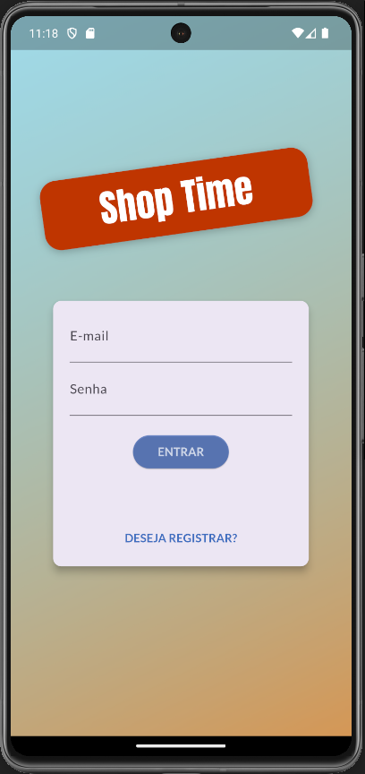

### Register 

### Product Overview
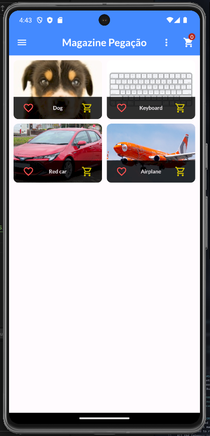

### Product Overview with favorite and cart added
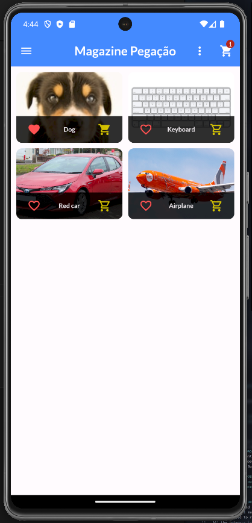

### Product Overview with favorite marked
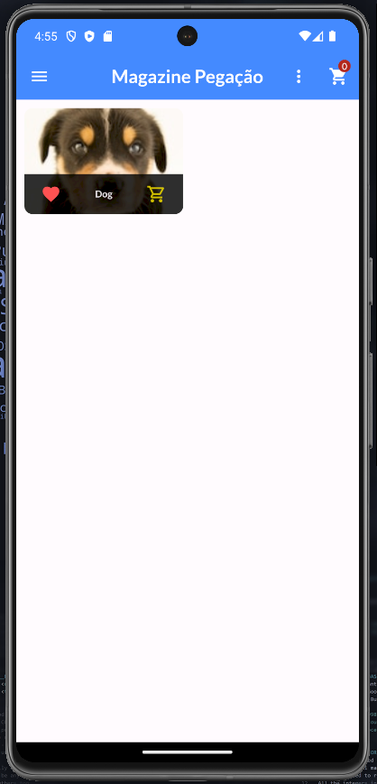

### Product Manager
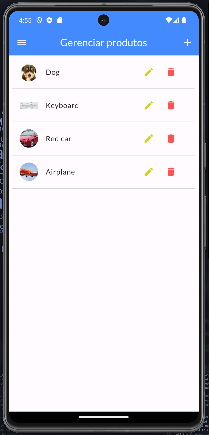

### Add Product
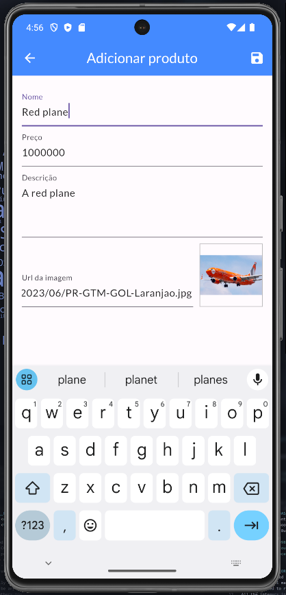

### Remove Product
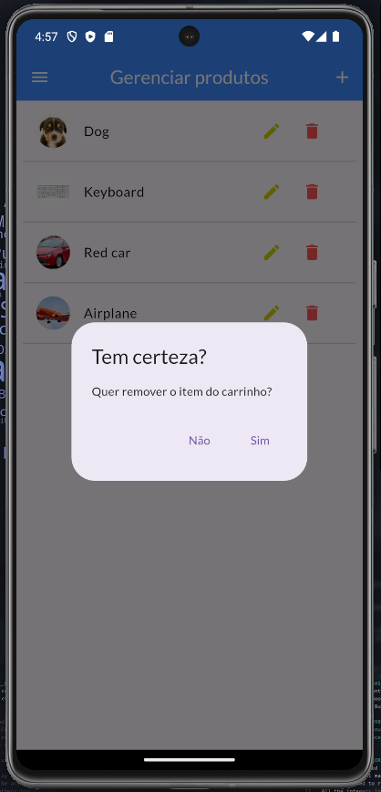

### Update Product
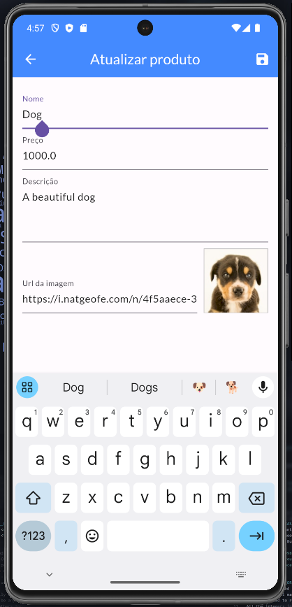

### Update Details
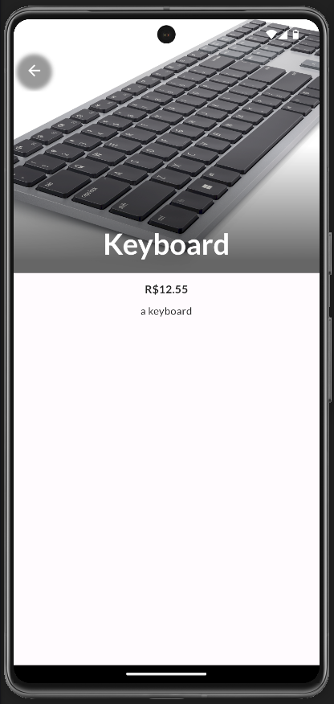

### Orders
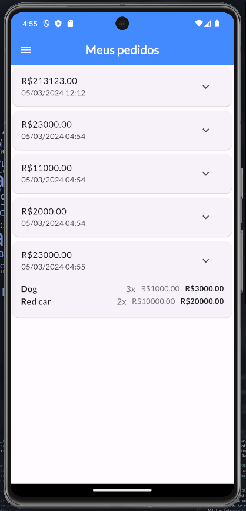

### Drawer Menu
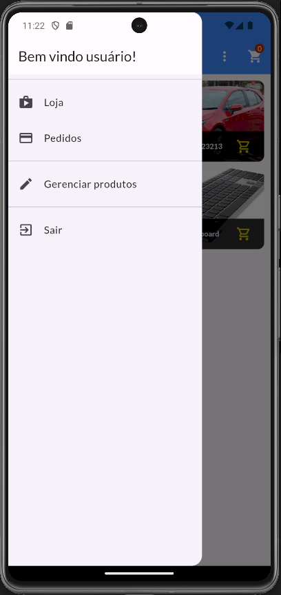

### Cart 
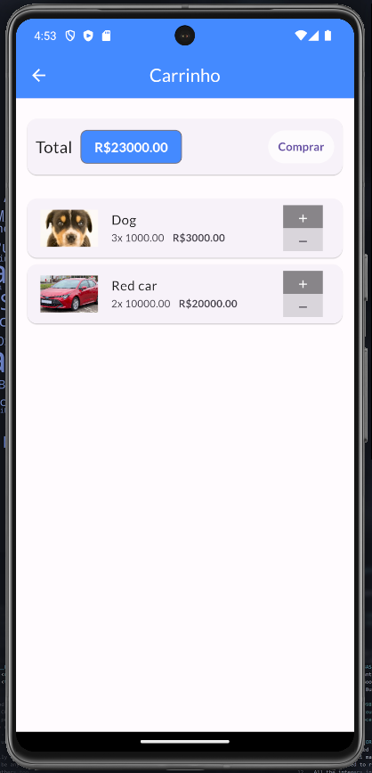

